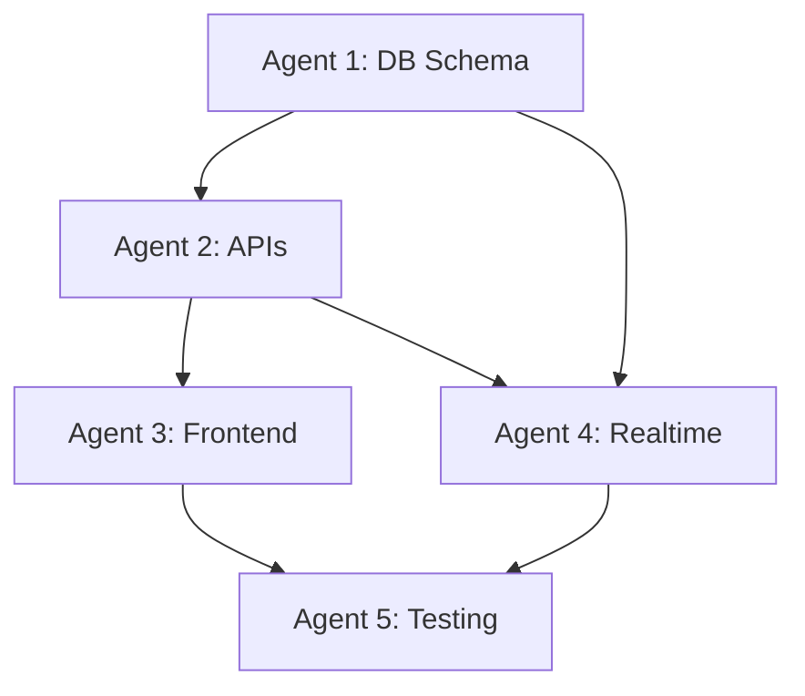

# 🤝 Agent Coordination Protocol

## 📋 Command Center Dashboard

### **Agent Status Board**
```yaml
Project: StumbleLele Friends Chat System
Timeline: 10 Days
Active_Agents: 5
Coordination_Mode: Parallel Execution
```

## 🎯 Daily Coordination Schedule

### **Day 1: Project Kickoff**
```
08:00 - All Agents Briefing
├── Project overview and individual responsibilities
├── Shared resources and communication channels
├── Dependency mapping and handoff protocols
└── Emergency escalation procedures

09:00 - Agent 1 (DB_ARCHITECT) Starts
├── Database schema design
├── Table relationships planning
└── Performance optimization strategy

18:00 - Daily Wrap-up
├── Agent 1 progress report
├── Tomorrow's agent activation plan
└── Blocker identification and resolution
```

### **Day 2: Multi-Agent Activation**
```
08:00 - Morning Standup
├── Agent 1: Schema progress update
├── Agent 2: API planning session
└── Dependency handoff preparation

09:00 - Agent 2 (API_DEVELOPER) Starts
├── Waiting for Agent 1 schema completion
├── API endpoint design and planning
└── Business logic architecture

14:00 - First Handoff
├── Agent 1 → Agent 2: Database schema complete
├── Documentation transfer
└── Q&A session for clarification

18:00 - Daily Wrap-up
├── Two-agent progress review
├── Tomorrow's frontend activation
└── Integration point planning
```

### **Day 3-10: Full Parallel Execution**
```
08:00 - All Agents Morning Standup
├── Progress reports from all active agents
├── Dependency status updates
├── Blocker identification and resolution
└── Day's priority alignment

12:00 - Midday Check-in
├── Quick sync on handoff readiness
├── Resource sharing and coordination
└── Afternoon priority adjustments

16:00 - Integration Status
├── Component compatibility checks
├── API contract validation
└── UI/UX alignment verification

18:00 - Daily Wrap-up
├── All agents progress summary
├── Tomorrow's priorities and dependencies
└── Risk assessment and mitigation
```

## 🔄 Handoff Protocols

### **Schema → API Handoff (Day 2)**
```yaml
From: Agent 1 (DB_ARCHITECT)
To: Agent 2 (API_DEVELOPER)
Trigger: Database schema 100% complete
Required_Deliverables:
  - Complete SQL migration scripts
  - Entity relationship diagram
  - Sample data for testing
  - RLS policy documentation
Verification: Agent 2 can create test API endpoints
```

### **API → Frontend Handoff (Day 3)**
```yaml
From: Agent 2 (API_DEVELOPER)
To: Agent 3 (FRONTEND_CORE)
Trigger: API structure 80% defined
Required_Deliverables:
  - API endpoint documentation
  - TypeScript interfaces
  - Request/response examples
  - Error handling patterns
Verification: Agent 3 can mock API calls
```

### **Foundation → Realtime Handoff (Day 4)**
```yaml
From: Agent 1 + Agent 2
To: Agent 4 (REALTIME_SPECIALIST)
Trigger: Database + API ready for subscriptions
Required_Deliverables:
  - Supabase realtime configuration
  - Table triggers for notifications
  - WebSocket connection patterns
  - Event handling documentation
Verification: Agent 4 can create test subscriptions
```

### **Components → Testing Handoff (Day 6)**
```yaml
From: Agent 3 + Agent 4
To: Agent 5 (INTEGRATION_TESTER)
Trigger: Core functionality 70% complete
Required_Deliverables:
  - Component test IDs
  - User flow documentation
  - Mock data generators
  - Testing environment setup
Verification: Agent 5 can run automated tests
```

## 📞 Communication Channels

### **Primary Communication**
- **Slack/Teams Channel**: `#stumblelele-friends-chat`
- **Daily Standups**: 08:00 AM (15 minutes)
- **Emergency Escalation**: Direct message to Project Lead
- **Documentation**: Shared Google Docs with real-time editing

### **Code Coordination**
- **Repository**: GitHub with feature branches
- **Branch Naming**: `agent-{id}-{feature}` (e.g., `agent-1-database-schema`)
- **Pull Requests**: Required review from one other agent
- **Merge Strategy**: Squash and merge to main

### **Issue Tracking**
- **GitHub Issues**: For dependencies and blockers
- **Labels**: `agent-1`, `agent-2`, `dependency`, `blocker`, `urgent`
- **Milestones**: Daily milestones for progress tracking
- **Assignments**: Clear ownership and responsibility

## 🚨 Escalation Procedures

### **Level 1: Self-Resolution (0-2 hours)**
```yaml
Scope: Minor technical issues, clarifications
Action: Agent attempts to resolve independently
Examples:
  - API endpoint naming conventions
  - UI component styling decisions
  - Database index optimization
```

### **Level 2: Peer Consultation (2-4 hours)**
```yaml
Scope: Technical blockers affecting other agents
Action: Consult with relevant agent or team
Examples:
  - Database schema changes affecting API
  - API contract changes affecting frontend
  - Realtime subscription performance issues
```

### **Level 3: Team Discussion (4-8 hours)**
```yaml
Scope: Architectural decisions, major blockers
Action: Emergency team meeting
Examples:
  - Database migration strategy change
  - API versioning decisions
  - Security policy modifications
```

### **Level 4: Project Lead (8+ hours)**
```yaml
Scope: Project-threatening issues
Action: Escalate to project leadership
Examples:
  - Agent unavailability
  - Technical impossibility
  - Scope change requirements
```

## 📋 Dependency Management

### **Critical Path Dependencies**


### **Dependency Tracking Matrix**
```yaml
Agent_1_Dependencies:
  - None (can start immediately)
  - Self-sufficient for Days 1-3

Agent_2_Dependencies:
  - Agent 1: Database schema (Day 2)
  - Blocking: Cannot start API development without schema

Agent_3_Dependencies:
  - Agent 2: API structure (Day 3)
  - Can start: Layout and static components
  - Blocking: Cannot integrate without API contracts

Agent_4_Dependencies:
  - Agent 1: Database setup (Day 4)
  - Agent 2: API structure (Day 4)
  - Can start: Supabase configuration
  - Blocking: Cannot test without data layer

Agent_5_Dependencies:
  - Agent 3: UI components (Day 6)
  - Agent 4: Realtime features (Day 6)
  - Can start: Test framework setup
  - Blocking: Cannot test without features
```

## 📊 Progress Tracking

### **Daily Progress Template**
```yaml
Date: [YYYY-MM-DD]
Sprint_Day: [1-10]

Agent_1_Status:
  - Current_Task: "Database schema creation"
  - Progress: "75% complete"
  - Blockers: "None"
  - Tomorrow: "Complete RLS policies"

Agent_2_Status:
  - Current_Task: "Friend management APIs"
  - Progress: "Waiting for schema handoff"
  - Blockers: "Dependency on Agent 1"
  - Tomorrow: "Start API development"

Agent_3_Status:
  - Current_Task: "UI component planning"
  - Progress: "Design mockups complete"
  - Blockers: "None"
  - Tomorrow: "Start component development"

Agent_4_Status:
  - Current_Task: "Realtime architecture"
  - Progress: "Not started"
  - Blockers: "Waiting for database and APIs"
  - Tomorrow: "Continue planning"

Agent_5_Status:
  - Current_Task: "Test framework setup"
  - Progress: "Not started"
  - Blockers: "Waiting for components"
  - Tomorrow: "Prepare testing environment"

Overall_Health: "Green" | "Yellow" | "Red"
Critical_Issues: []
Next_Day_Priorities: []
```

### **Weekly Milestones**
```yaml
Week_1_Milestones:
  - Day 3: Database schema complete and deployed
  - Day 5: Core API endpoints functional
  - Day 7: Basic UI components rendered

Week_2_Milestones:
  - Day 8: Realtime messaging working
  - Day 9: Full integration complete
  - Day 10: Production deployment ready
```

## 🎯 Quality Gates

### **Daily Quality Checks**
```yaml
Code_Quality:
  - All code passes linting
  - TypeScript compilation successful
  - No security vulnerabilities detected

Functionality:
  - New features have basic tests
  - No breaking changes to existing APIs
  - Documentation updated for new features

Integration:
  - Components work with existing system
  - No conflicts with other agents' work
  - Performance benchmarks maintained
```

### **Weekly Quality Reviews**
```yaml
Architecture_Review:
  - System design consistency
  - Performance optimization opportunities
  - Security best practices compliance

User_Experience:
  - Child-friendly interface compliance
  - Mobile responsiveness verification
  - Accessibility standards adherence

System_Health:
  - End-to-end functionality testing
  - Performance benchmarks validation
  - Security penetration testing
```

## 🛠️ Shared Resources

### **Development Environment**
```yaml
Database: Supabase (shared instance)
API_Testing: Postman collection (shared)
UI_Components: Storybook (shared)
Code_Repository: GitHub (shared)
Documentation: Google Docs (shared)
```

### **Testing Resources**
```yaml
Test_Database: Supabase (test instance)
Mock_Data: Shared fixtures in /tests/fixtures
Test_Users: Predefined test accounts
API_Mocks: Shared mock server configuration
```

### **Deployment Resources**
```yaml
Staging_Environment: Vercel (preview deployments)
Production_Environment: Vercel (production)
Monitoring: Vercel Analytics + Custom logging
Error_Tracking: Sentry (if needed)
```

## 🎉 Success Celebration

### **Daily Wins**
- Celebrate individual agent achievements
- Share progress screenshots and demos
- Acknowledge problem-solving successes
- Recognize cross-agent collaboration

### **Weekly Milestones**
- Demo working features to stakeholders
- Document lessons learned
- Plan next week's priorities
- Team retrospective and improvements

### **Final Delivery**
- Complete system demonstration
- Performance benchmarks celebration
- Security audit success
- Production deployment party

---

## 📞 Emergency Contacts

### **Agent Leads**
- **Agent 1 (DB)**: Database architecture expertise
- **Agent 2 (API)**: Backend development expertise
- **Agent 3 (UI)**: Frontend development expertise
- **Agent 4 (RT)**: Realtime systems expertise
- **Agent 5 (QA)**: Testing and integration expertise

### **Technical Escalation**
- **Supabase Issues**: Database and realtime problems
- **Vercel Issues**: Deployment and hosting problems
- **Integration Issues**: Cross-component compatibility

### **Project Management**
- **Daily Standups**: Coordination and planning
- **Blocker Resolution**: Dependency management
- **Scope Changes**: Feature modification requests

---

**Let's build an amazing friends chat system together! 🚀**