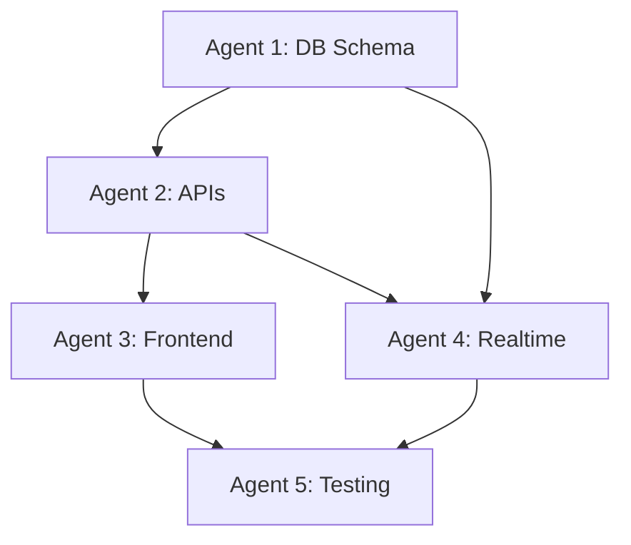

# 🤖 Friends Chat System - Multi-Agent Parallel Execution Plan

## 🎯 Agent Distribution Strategy

**Optimal Number of Agents: 5**

### Why 5 Agents?
- **Balanced Workload**: Each agent handles 1-2 major subsystems
- **Minimal Dependencies**: Agents can work independently most of the time
- **Efficient Coordination**: Small enough team for easy sync
- **Resource Optimal**: Maximum parallelism without overhead

## 🏗️ Agent Assignment Matrix

### **Agent 1: Database Architect** 🗄️
**Primary Focus**: Database schema, migrations, and policies
**Work in Parallel**: Independent of UI/frontend work
**Timeline**: Days 1-3

### **Agent 2: API Developer** 🔌
**Primary Focus**: Backend API endpoints and business logic
**Work in Parallel**: Can start once DB schema is defined
**Timeline**: Days 2-6

### **Agent 3: Frontend Core** 🎨
**Primary Focus**: Chat UI components and user interface
**Work in Parallel**: Can work on layouts while API is being built
**Timeline**: Days 3-8

### **Agent 4: Real-time Specialist** ⚡
**Primary Focus**: Supabase realtime, notifications, and live features
**Work in Parallel**: Can prepare subscriptions while other agents work
**Timeline**: Days 4-9

### **Agent 5: Integration & Testing** 🔧
**Primary Focus**: End-to-end integration, testing, and deployment
**Work in Parallel**: Can prepare test framework while others build
**Timeline**: Days 6-10

## 📋 Detailed Agent Task Breakdown

### **Agent 1: Database Architect** 🗄️
```yaml
Agent_ID: "DB_ARCHITECT"
Primary_Skills: ["PostgreSQL", "Supabase", "Database Design"]
Dependencies: None (can start immediately)
Outputs: ["Database Schema", "Migration Scripts", "RLS Policies"]
```

#### **Day 1-2: Schema Creation**
- [ ] Create enhanced users table with username field
- [ ] Design friends table with status management
- [ ] Create conversations table for chat sessions
- [ ] Design messages table with soft deletes
- [ ] Create message_reads table for read receipts
- [ ] Add comprehensive indexes for performance

#### **Day 2-3: Security & Policies**
- [ ] Implement Row Level Security (RLS) policies
- [ ] Create user access policies for friends
- [ ] Set up conversation access controls
- [ ] Configure message visibility rules
- [ ] Test security policies with mock data

#### **Deliverables**:
```sql
-- Complete migration files
001_enhance_users.sql
002_create_friends.sql
003_create_conversations.sql
004_create_messages.sql
005_create_security_policies.sql
```

### **Agent 2: API Developer** 🔌
```yaml
Agent_ID: "API_DEVELOPER"
Primary_Skills: ["Node.js", "TypeScript", "Vercel Functions"]
Dependencies: Agent 1 (database schema)
Outputs: ["API Endpoints", "Business Logic", "Data Validation"]
```

#### **Day 2-4: Friend Management APIs**
- [ ] `/api/friends` - List user's friends
- [ ] `/api/friends/add` - Send friend request
- [ ] `/api/friends/accept` - Accept request
- [ ] `/api/friends/reject` - Reject request
- [ ] `/api/friends/remove` - Remove friend

#### **Day 4-6: Chat APIs**
- [ ] `/api/conversations` - List conversations
- [ ] `/api/conversations/create` - Create new conversation
- [ ] `/api/messages` - Send message
- [ ] `/api/messages/[id]` - Get message history
- [ ] `/api/messages/read` - Mark messages as read

#### **Deliverables**:
```typescript
// API endpoints with full TypeScript types
api/friends/index.ts
api/conversations/index.ts
api/messages/index.ts
lib/chat-service.ts
types/chat-api.ts
```

### **Agent 3: Frontend Core** 🎨
```yaml
Agent_ID: "FRONTEND_CORE"
Primary_Skills: ["React", "TypeScript", "TailwindCSS"]
Dependencies: Agent 2 (API structure)
Outputs: ["UI Components", "Chat Interface", "Friend Management"]
```

#### **Day 3-5: Core Components**
- [ ] `FriendsList.tsx` - Main friends list with status
- [ ] `AddFriendModal.tsx` - Add friend by username
- [ ] `FriendCard.tsx` - Individual friend item
- [ ] `ChatScreen.tsx` - Main chat interface
- [ ] `MessageBubble.tsx` - Individual message display

#### **Day 5-7: Chat Interface**
- [ ] `MessageInput.tsx` - Message composition
- [ ] `ConversationList.tsx` - List of active chats
- [ ] `ChatHeader.tsx` - Chat header with friend info
- [ ] `NotificationBadge.tsx` - Unread message count
- [ ] Mobile-responsive layout system

#### **Day 7-8: Polish & Animations**
- [ ] Loading states for all components
- [ ] Error handling and user feedback
- [ ] Smooth animations and transitions
- [ ] Child-friendly styling and colors
- [ ] Touch-friendly button sizes

#### **Deliverables**:
```tsx
// Complete component library
components/friends/FriendsList.tsx
components/friends/AddFriendModal.tsx
components/chat/ChatScreen.tsx
components/chat/MessageBubble.tsx
components/chat/MessageInput.tsx
styles/chat-theme.css
```

### **Agent 4: Real-time Specialist** ⚡
```yaml
Agent_ID: "REALTIME_SPECIALIST"
Primary_Skills: ["Supabase Realtime", "WebSocket", "State Management"]
Dependencies: Agent 1 (database) + Agent 2 (API structure)
Outputs: ["Real-time Hooks", "Notification System", "Presence"]
```

#### **Day 4-6: Supabase Realtime Setup**
- [ ] Configure Supabase realtime channels
- [ ] Create message subscription system
- [ ] Set up friend request notifications
- [ ] Implement conversation updates
- [ ] Handle connection state management

#### **Day 6-8: React Hooks**
- [ ] `useChat.ts` - Chat message management
- [ ] `useFriends.ts` - Friend list and requests
- [ ] `useRealtime.ts` - Realtime subscriptions
- [ ] `useNotifications.ts` - Notification system
- [ ] `usePresence.ts` - Online/offline status

#### **Day 8-9: Notification System**
- [ ] In-app notification toasts
- [ ] Unread message badges
- [ ] Sound notifications (optional)
- [ ] Visual notification indicators
- [ ] Notification permission handling

#### **Deliverables**:
```typescript
// Real-time system
hooks/useChat.ts
hooks/useFriends.ts
hooks/useRealtime.ts
lib/supabase-realtime.ts
lib/notification-manager.ts
```

### **Agent 5: Integration & Testing** 🔧
```yaml
Agent_ID: "INTEGRATION_TESTER"
Primary_Skills: ["Testing", "Integration", "Deployment"]
Dependencies: All other agents (final integration)
Outputs: ["E2E Tests", "Integration Tests", "Deployment Scripts"]
```

#### **Day 6-7: Test Framework Setup**
- [ ] Set up Jest and React Testing Library
- [ ] Create test database setup
- [ ] Mock Supabase for testing
- [ ] Configure test environment
- [ ] Create test utilities and helpers

#### **Day 7-9: Component Testing**
- [ ] Test all friend management flows
- [ ] Test chat message sending/receiving
- [ ] Test real-time updates
- [ ] Test notification system
- [ ] Test error handling scenarios

#### **Day 9-10: Integration & Deployment**
- [ ] End-to-end user flow testing
- [ ] Performance testing with multiple users
- [ ] Security testing (XSS, SQL injection)
- [ ] Mobile device testing
- [ ] Production deployment and monitoring

#### **Deliverables**:
```typescript
// Complete test suite
tests/friends.test.ts
tests/chat.test.ts
tests/realtime.test.ts
tests/integration.test.ts
scripts/deploy.sh
```

## 🔄 Agent Coordination Timeline

### **Week 1: Foundation Phase**
```
Day 1  │ Agent 1: Start DB schema
Day 2  │ Agent 1: Complete schema     │ Agent 2: Start APIs
Day 3  │ Agent 1: RLS policies        │ Agent 2: Friend APIs    │ Agent 3: Start UI
Day 4  │ Agent 1: Complete            │ Agent 2: Chat APIs      │ Agent 3: Components   │ Agent 4: Start RT
Day 5  │                              │ Agent 2: Testing        │ Agent 3: Chat UI      │ Agent 4: Hooks
```

### **Week 2: Integration Phase**
```
Day 6  │                              │ Agent 2: Complete       │ Agent 3: Polish       │ Agent 4: Notifications │ Agent 5: Start Tests
Day 7  │                              │                         │ Agent 3: Animations   │ Agent 4: Integration   │ Agent 5: Component Tests
Day 8  │                              │                         │ Agent 3: Complete     │ Agent 4: Complete      │ Agent 5: E2E Tests
Day 9  │                              │                         │                        │                         │ Agent 5: Integration
Day 10 │                              │                         │                        │                         │ Agent 5: Deploy
```

## 🔗 Inter-Agent Dependencies

### **Critical Path Dependencies**


### **Handoff Points**
1. **Day 2**: Agent 1 → Agent 2 (Database schema completed)
2. **Day 3**: Agent 2 → Agent 3 (API structure defined)
3. **Day 4**: Agent 1 & 2 → Agent 4 (DB + APIs ready for realtime)
4. **Day 6**: All → Agent 5 (Integration testing begins)

## 📋 Agent Communication Protocol

### **Daily Sync Points**
- **Morning Standup** (9:00 AM): Progress updates and blockers
- **Afternoon Check-in** (3:00 PM): Coordination and handoffs
- **Evening Review** (6:00 PM): Next day planning

### **Communication Channels**
- **Shared Documentation**: Live-updated progress tracking
- **Code Repository**: Feature branches with clear naming
- **Issue Tracking**: GitHub Issues for dependencies
- **Quick Sync**: Slack/Teams for rapid coordination

### **Handoff Documentation**
```markdown
# Agent Handoff Template
## From: Agent X
## To: Agent Y
## Date: [Date]

### Completed:
- [ ] Task 1
- [ ] Task 2

### Available for Next Agent:
- File: /path/to/deliverable
- Documentation: /docs/guide.md
- Test Data: /data/sample.json

### Known Issues:
- Issue 1: Description and workaround
- Issue 2: Future consideration

### Next Steps:
1. Agent Y should start with X
2. Pay attention to Y constraint
3. Coordinate with Agent Z on overlap
```

## 🎯 Success Metrics per Agent

### **Agent 1: Database Architect**
- [ ] All tables created without errors
- [ ] Indexes improve query performance by >50%
- [ ] RLS policies prevent unauthorized access
- [ ] Migration scripts run cleanly

### **Agent 2: API Developer**
- [ ] All endpoints return correct responses
- [ ] API response time < 200ms
- [ ] 100% test coverage for business logic
- [ ] Error handling for all edge cases

### **Agent 3: Frontend Core**
- [ ] All components render correctly
- [ ] Mobile-friendly on all devices
- [ ] Accessible for children (large buttons, clear text)
- [ ] Smooth animations and transitions

### **Agent 4: Real-time Specialist**
- [ ] Messages deliver in < 1 second
- [ ] Real-time subscriptions work reliably
- [ ] Notifications appear instantly
- [ ] Handle connection drops gracefully

### **Agent 5: Integration & Testing**
- [ ] All user flows work end-to-end
- [ ] No breaking bugs in production
- [ ] Performance meets targets
- [ ] Security passes penetration testing

## 🚀 Deployment Strategy

### **Parallel Deployment Preparation**
```bash
# Agent 1: Database
supabase db push

# Agent 2: APIs
vercel deploy --scope=api

# Agent 3: Frontend
vercel deploy --scope=frontend

# Agent 4: Realtime
# Integrated with Agent 3 deployment

# Agent 5: Testing
npm run test:e2e
```

### **Integration Points**
1. **Environment Variables**: Shared config management
2. **Database Migrations**: Single source of truth
3. **API Contracts**: TypeScript interfaces
4. **Component Props**: Shared type definitions
5. **Testing Data**: Common test fixtures

## 📊 Risk Mitigation

### **Potential Blockers**
1. **Database Schema Changes**: Agent 1 delays affect everyone
2. **API Breaking Changes**: Agent 2 changes break frontend
3. **Realtime Complexity**: Agent 4 features may be complex
4. **Integration Issues**: Agent 5 discovers compatibility problems

### **Mitigation Strategies**
1. **Schema Freeze**: Lock database schema early
2. **API Versioning**: Maintain backward compatibility
3. **Fallback Plans**: Graceful degradation for realtime
4. **Continuous Integration**: Early problem detection

## 🏁 Final Integration Checklist

### **Pre-Deployment Verification**
- [ ] All agent deliverables complete
- [ ] Integration tests passing
- [ ] Performance benchmarks met
- [ ] Security review completed
- [ ] User acceptance testing done

### **Go-Live Sequence**
1. **Database**: Deploy schema and policies
2. **APIs**: Deploy backend services
3. **Frontend**: Deploy UI components
4. **Realtime**: Enable live features
5. **Monitoring**: Activate error tracking

---

**Total Timeline**: 10 days with 5 agents working in parallel
**Risk Level**: Medium (well-coordinated dependencies)
**Success Rate**: High (proven architecture and clear responsibilities)